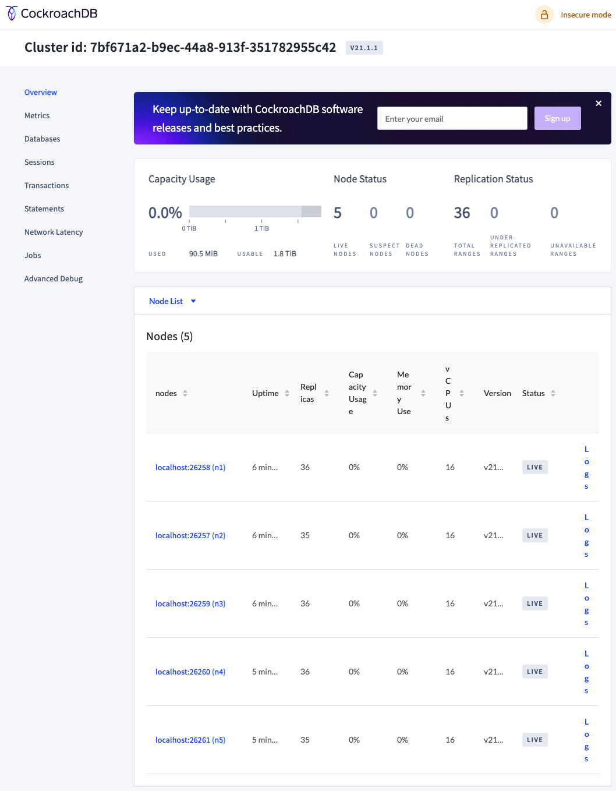

# CockroachDB-Playground
## Basic Concepts

- **Table joins**: A term for read operations that pull together separate records into one
- **Transactions**: A combination of read and write and especially writes across that database, but they need to happen together
- SQL Databases: Traditional SQL databases delivered ACID transactions and joins easily, but scalability and high availability were difficult to implement.

## What is CockroachDB?

- Distributed SQL Database
- OLTP (Online Transactional Processing) workloads: Means a client only touches a few line of record, but a lot of clients are doing this in parallel.

### Distributed SQL

| SQL              | NO SQL          |
| ---------------- | --------------- |
| Bad Scale        | Good Scale      |
| Good Consistency | Bad Consistency |
| Bad Resiliency   | Good Resiliency |
| Good SQL         | Bad SQL         |

### ACID Transactions

> ACID - A set of properties of database transactions to guarantee validity in event of errors/power failures.

- A - **Atomicity** requires transactions are "All or nothing"
- C - **Consistency** enforces rules on database. any data written in a transaction will be valid according to all defined rules, including SQL constraints
- I - **Isolation** ensures that concurrent transactions will leave the database in the same state that it would have been in if the transactions were executed serially, one after anther.
- D - **Durability** guarantees that once a transaction is committed, it will remain so even in the event of power loss, crashes or failures

## Keyspace Ranges Replicas

- Basic Model of Cluster Data: **Keyspace**
- Keyspace divided into **rangers**
- **Replicas** = copies of ranges
- Replicas distributed among **nodes of cluster**

### Keyspace

- key has the info about where a data lives (which node should go to)
- primary key of that data row

### Ranges - Also the units CockroachDB replicates and distributes to nodes of cluster

- Keyspace get split into multiple ranges
- Each ranges will be split to 2x ranges when it is larger than 512MB by default

### Replicas

- Each range will be replicated THREE times by default. 
- And distributed into different nodes.

## Raft Protocol in CockroachDB

- CockroachDB used Raft Protocol in all writes.

- Each **range group** is called a **raft group**

### Lease is assigned to leaseholder AND leaseholder is one of the replicas

- Lease will be assigned to any one of the replicas
- Replicas will be either **leaders** or **followers**
- **Leader** will be selected from all replicas by **elections**
- Usually **Leader = LeaseHolder** for efficient purpose
- writes are started by leaseholder
- Leaseholder will append the write commend in **raft log** and pass commend to other replicas
- Other replicas will persist the writes even though the leasehold failed.
- In the meanwhile, read can still be done while the replicas are trying to address **Distributed consensus** for writes via Raft (It means all nodes will have to agree on the write operation, then this write opeartion will be committed)
- And most importantly, leaseholders ensure **readers only see committed writes**

## Availability and Durability

Read:

- Client can connect to any node as **gateway**
- gateway will **route the query to the leaseholder**
- leaseholder will tell the query where to find the data for read

Write:

- Client can connect to any node as **gateway**
- gateway will **route the query to the leaseholder/leader**
- Leader will begin a **consensus check**
- Once **most of the replicas' raft log have the write commend**. It will ACK the client.

What if there is one node down when we only have THREE nodes: 

- if the node is gateway: BAD, client has to find another node - using **load balancing**
- if not, but Leader happens to be inside the broken: BAD, we will start a election and get a new leader/leaseholder.
- Then everything works normally. Just take a bit latency to elect a new leader
- Once the failed node gets back up, it will be syncd again.
- If one more node is dead: SUPER BAD: Zero guarantee from now on since there is no replicas/leaseholder/leader in any way. Only one node cannot guarantee anything.
- Worst case: THREE nodes TWO Dead, roughly work. Three ALL DEAD, end of the world.

## Resiliency

- Lets assume replica factor is THREE, and we have SEVEN nodes
- If one nodes dead, DB will wait 5 mins by default for it to reconnect
- If over 5 mins, DB will up-replicate remaing replicas to other nodes that DO NOT have the range already.
- Then it will be back to 3 replicas in 6 nodes.
- Conclusion here is bigger replica factor and more nodes - SAFER (5 replicas and nodes can handle 2 nodes dead at the same time)

## Start an Insecure Single-Node Cluster

```bash
cockroach start-single-node --insecure --listen-addr=localhost:26257 --http-
addr=localhost:8080
```

To load some [MovR](https://www.cockroachlabs.com/docs/stable/movr.html) for testing

```bash
cockroach workload init movr
```

Connect to built-in SQL shell

```bash
cockroach sql --insecure
```

Testing SQL shell

```sql
SHOW databases;
SHOW TABLES FROM movr;
SELECT * FROM movr.users LIMIT 10;
```

Creating and Modifying a Table

```sql
CREATE DATABASE crdb_uni;
```

Set to current DB

```sql
SET database = crdb_uni;
```

Create new table students - single primary key

```sql
CREATE TABLE students (id UUID PRIMARY KEY DEFAULT gen_random_uuid(), name STRING);
```

To Show the created table

```sql
SHOW CREATE students;
```

Create new table courses - composited primary key

```sql
CREATE TABLE courses (sys_id UUID DEFAULT gen_random_uuid(), course_id INT, name STRING, PRIMARY KEY (sys_id, course_id));

SHOW CREATE TABLE courses;
```

Alter a table

```sql
ALTER TABLE courses ADD COLUMN schedule STRING;

SHOW CREATE TABLE courses;
```

## Secondary Indexes

- Create a index that can tell us where the primary key is
- For example: primary key is user's `id`, but I want to filter a table with user's `first` and `last` name
- CockroachDB let you create a index by `CREATE INDEX my_index` 
- Once we have the index, DB doesn't have to scan and filter the database. - MUCH FASTER

```shell
cat index_demo.sql
```

```sql
DROP TABLE IF EXISTS users;
CREATE TABLE users (id INT PRIMARY KEY,
                    last_name STRING NOT NULL,
                    first_name STRING NOT NULL,
                    country STRING,
                    city STRING);
INSERT INTO users (id, last_name, first_name, country, city)
     VALUES (1, 'Cross', 'William', 'USA', 'Jersey City'),
            (2, 'Seldess', 'Jesse', 'USA', 'New York'),
            (3, 'Hirata', 'Lauren', 'USA', 'New York'),
            (4, 'Cross', 'Zachary', 'USA', 'Seattle'),
            (5, 'Shakespeare', 'William', 'UK', 'Stratford-upon-Avon');
```

```shell
cockroach sql --insecure < index_demo.sql 
```

```sql
 SELECT * FROM users;
```

Find out what the indexes is

```sql
SHOW INDEXES FROM users;
```

How the database query data

```sql
SELECT * FROM users WHERE id = 1;
EXPLAIN SELECT * FROM users WHERE id = 1;
EXPLAIN SELECT * FROM users WHERE last_name = 'Cross' AND first_name = 'William';
```

Create index

```sql
CREATE INDEX my_index ON users (last_name, first_name);
SHOW INDEXES FROM users;
EXPLAIN SELECT * FROM users WHERE last_name = 'Cross' AND first_name = 'William';
```

## Transaction Syntax

- Use `BEGIN` to start a multi-statement transaction
- DB will block any transaction that try to do alter this transaction
- After we hit `COMMIT` on the first transaction, the second one can do transaction after the first one
- If the second transaction show an error, we will need to `ROLLBACK` on the second transaction.
- Keep data safe and guarantee interigrity

First Transaction:

```sql
SHOW TABLES FROM bank;
SELECT * FROM bank.customers;
SELECT * FROM bank.accounts;
SELECT balance >= 50 FROM bank.accounts WHERE type = 'checking' AND customer_id = 2;
UPDATE bank.accounts SET balance = balance - 50 WHERE type = 'checking' AND customer_id = 2;
SELECT * FROM bank.accounts WHERE type = 'checking' AND customer_id = 2;
BEGIN;
SELECT balance >= 200 FROM bank.accounts WHERE type = 'checking' AND customer_id = 2;
UPDATE bank.accounts SET balance = balance - 200 WHERE type = 'checking' AND customer_id = 2;
COMMIT;
```

Second Transaction:

```sql
BEGIN;
SELECT balance >= 200 FROM bank.accounts WHERE type = 'checking' AND customer_id = 2;
UPDATE bank.accounts SET balance = balance - 200 WHERE type = 'checking' AND customer_id = 2;
ROLLBACK;
SELECT * FROM bank.accounts WHERE type = 'checking' AND customer_id=2;
```

## Stop and Delete CockroachDB

```shell
pkill -9 cockroach
rm -r cocoroach-data
```

## Spin up and Scale Out a Local Cluster

- we can keep adding new nodes to the existing cluster

```sql
cockroach start --insecure --listen-addr=localhost:26257 --join=localhost:26257,localhost:26258,localhost:26259 \
  --http-addr=localhost:8080 --store=cockroach-data-1 --background
cockroach start --insecure --listen-addr=localhost:26257 --join=localhost:26257,localhost:26258,localhost:26259 \
  --http-addr=localhost:8081 --store=cockroach-data-2 --background  # this will error out
cockroach start --insecure --listen-addr=localhost:26258 --join=localhost:26257,localhost:26258,localhost:26259 \
  --http-addr=localhost:8081 --store=cockroach-data-2 --background
cockroach start --insecure --listen-addr=localhost:26259 --join=localhost:26257,localhost:26258,localhost:26259 \
--http-addr=localhost:8082 --store=cockroach-data-3 --background

cockroach init --host localhost:26258 --insecure

open http://localhost:8080

cockroach start --insecure --listen-addr=localhost:26260 \
  --join=localhost:26257,localhost:26258,localhost:26259,localhost:26260,localhost:26261 \
  --http-addr=localhost:8083 --store=cockroach-data-4 --background
cockroach start --insecure --listen-addr=localhost:26261 \
  --join=localhost:26257,localhost:26258,localhost:26259,localhost:26260,localhost:26261 \
  --http-addr=localhost:8084 --store=cockroach-data-5 --background
```

## Admin UI



## Localities flags

- DB can be distributed across different countries or regions. 
- **Most importantly, the nodes will be distributed evenly across the geo-locations.**
- `--locality=country=us,region=us-east` 
- First `Country` then `region`

```shell
cockroach start --insecure --locality=country=us,region=us-east --store=node1 --listen-addr=localhost:26257 --http-addr=localhost:8080 --join=localhost:26257,localhost:26258,localhost:26259 --background
```

## Geo-partitioning

- If all nodes are distributed evenly across the country, there would be a hugh latency in writes.
- So we can geo-partition the data by `ROW`s - THAT"S SO COOL.
- Each row can be marked and get pertitioned into different location's node - making the replicas near each other. So it would reduce latency. 

```sql
SHOW RANGES FROM TABLE movr.vehicles;

ALTER TABLE movr.vehicles
PARTITION BY LIST (city) (
    PARTITION new_york VALUES IN ('new york'),
    PARTITION boston VALUES IN ('boston'),
    PARTITION washington_dc VALUES IN ('washington dc'),
    PARTITION seattle VALUES IN ('seattle'),
    PARTITION san_francisco VALUES IN ('san francisco'),
    PARTITION los_angeles VALUES IN ('los angeles')
);

ALTER PARTITION new_york OF TABLE movr.vehicles
CONFIGURE ZONE USING constraints='[+region=us-east]';

ALTER PARTITION boston OF TABLE movr.vehicles
CONFIGURE ZONE USING constraints='[+region=us-east]';

ALTER PARTITION washington_dc OF TABLE movr.vehicles
CONFIGURE ZONE USING constraints='[+region=us-central]';

ALTER PARTITION seattle OF TABLE movr.vehicles
CONFIGURE ZONE USING constraints='[+region=us-west]';

ALTER PARTITION san_francisco OF TABLE movr.vehicles
CONFIGURE ZONE USING constraints='[+region=us-west]';

ALTER PARTITION los_angeles OF TABLE movr.vehicles
CONFIGURE ZONE USING constraints='[+region=us-west]';

SELECT start_key, end_key, lease_holder_locality, replicas, replica_localities FROM [SHOW RANGES FROM TABLE movr.vehicles]
WHERE "start_key" NOT LIKE '%Prefix%' AND "end_key" NOT LIKE '%Prefix';
```

